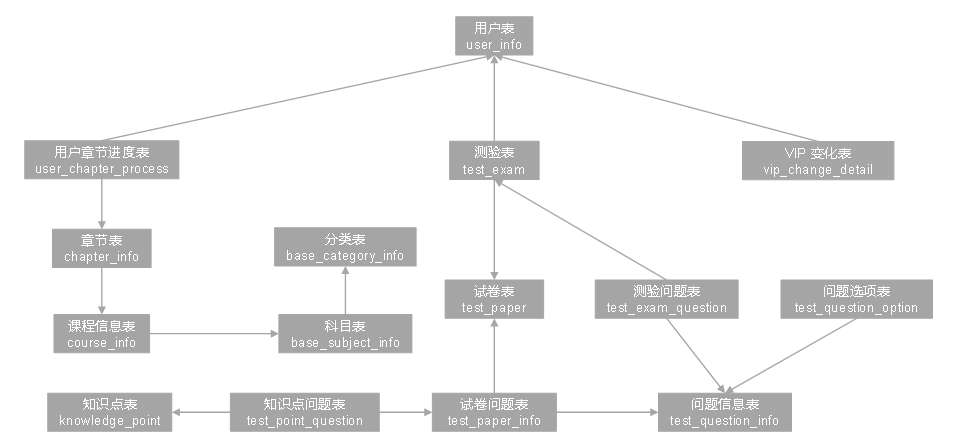

# 1 埋点行为数据

## 1.1 行为数据总览

- 页面数据
- 事件数据
- 曝光数据
- 启动数据
- 播放数据
- 错误数据

### 1.1.1 页面数据

页面数据主要记录一个页面的用户访问情况，包括访问时间、停留时间、页面路径等信息。

```json
{
  "actions": [
…
  ],
  "common": {
…
  },
  "displays": [
    …
  ],
  "page": {
    "during_time": 11622,
    "item": "57",
    "item_type": "course_id",
    "last_page_id": "course_list",
    "page_id": "course_detail"
  },
  "ts": 1645529967261
}
```

**页面类型：**

```txt
home("首页")
course_list("列表页")
course_detail("商品详情")
chapter_video("章节视频")
cart("购物车")
order("下单结算")
payment("支付页面")
exam("考试")
mine("我的")
```

**所以页面类型对象类型：**

```txt
courese_id("课程Id")
keyword("搜索关键词")
video_id("视频id")
chapter_id("章节id")
coupon_id("购物卷id")
order_id("订单id")
paper_id("考卷id")
exam_id("考试id")
```

### 1.1.2 事件数据

事件数据主要记录应用内一个具体操作行为，包括操作类型、操作对象、操作对象描述等信息。

```json
{
  "actions": [
    {
      "action_id": "favor_add",
      "item": "57",
      "item_type": "course_id",
      "ts": 1645529967261
    },
    {
      "action_id": "cart_add",
      "item": "57",
      "item_type": "course_id",
      "ts": 1645529967261
    }
  ],
  "common": {
…
  },
  "displays": [
…
  ],
  "page": {
…
  },
  "ts": 1645529967261
}
```

**动作类型：**

```txt
favor_add(新增收藏)
review_add(新增课程评价)
comment_add(新增章节评价)
cart_add(加入购物车)
```

**动作目标类型：**

```txt
course_id("课程_id")
keyword("搜索关键词")
video_id("视频id")
chapter_id("章节id")
coupon_id("购物卷id")
order_id("订单id")
pager_id("页面id")
exam_id("考试id")
```

### 1.1.3 曝光数据

曝光数据主要记录页面所展示的内容，包括曝光对象、曝光类型等信息

```json
{
  "actions": [
    …
  ],
  "common": {
    …
  },
  "displays": [
    {
      "display_type": "query",
      "item": "6",
      "item_type": "course_id",
      "order": 1,
      "pos_id": 4
    },
    {
      "display_type": "query",
      "item": "8",
      "item_type": "course_id",
      "order": 2,
      "pos_id": 5
    },
    {
      "display_type": "query",
      "item": "1",
      "item_type": "course_id",
      "order": 3,
      "pos_id": 4
    },
    {
      "display_type": "query",
      "item": "10",
      "item_type": "course_id",
      "order": 4,
      "pos_id": 1
    },
    {
      "display_type": "promotion",
      "item": "4",
      "item_type": "course_id",
      "order": 5,
      "pos_id": 4
    },
    {
      "display_type": "promotion",
      "item": "4",
      "item_type": "course_id",
      "order": 6,
      "pos_id": 4
    },
    {
      "display_type": "query",
      "item": "9",
      "item_type": "course_id",
      "order": 7,
      "pos_id": 1
    }
  ],
  "page": {
    …
  },
  "ts": 1645529967261
}
```

曝光类型：

```json
promotion("商品推广")
recomment("算法推荐商品")
query("查询结果商品")
activity("促销活动")
```

曝光对象类型：

```txt
course_id("课程id")
keyword("搜索关键字")
video_id("视频id")
chapter_id("章节id")
coupon_id("购物卷id")
order_id("订单id")
pager_id("页面id")
exam_id("考试id")
```

### 1.1.4 启动数据

启动数据记录记录应用的启动信息

```json
{
  "common": {
    …
  },
  "start": {
    "entry": "notice",
    "first_open": 0,
    "loading_time": 17970,
    "open_ad_id": 20,
    "open_ad_ms": 2876,
    "open_ad_skip_ms": 0
  },
  "ts": 1645532980257
}
```

启动入口类型：

```txt
icon("图标")
notic("通知")
install("安照后启动")
```

### 1.1.5 播放数据

播放数据记录播放信息

```json
{
  "appVideo": {
    "play_sec": 19,
    "video_id": "3904"
  },
  "common": {
…
  },
  "ts": 1645526307119
}
```

### 1.1.6 错误数据

错误数据记录应用使用过程中的错误信息，包括错误编号和错误信息

✨上述五种日志都有可能包含错误信息，此处仅对 appVideo 的错误日志进行展示。

```json
{
    "appVideo":{
  …
    },
    "common":{
  …
    },
    "err":{
        "error_code":3485,
        "msg":" Exception in thread \\  java.net.SocketTimeoutException\\n \\tat com.atguigu.edu2021.mock.log.AppError.main(AppError.java:xxxxxx)"
    },
    "ts":1645538276217
}
```

# 2 数据埋点

## 2.1 数据埋点方式

- 代码埋点
- 可视乎埋点
- 全埋点

​		**代码埋点**是通过调用埋点SDK函数，在需要埋点的业务逻辑功能位置调用接口，上报埋点数据。例如，我们对页面中的某个按钮埋点后，当这个按钮被点击时，可以在这个按钮对应的 OnClick 函数里面调用SDK提供的数据发送接口，来发送数据。

​		**可视化埋点**只需要研发人员集成采集 SDK，不需要写埋点代码，业务人员就可以通过访问分析平台的“圈选”功能，来“圈”出需要对用户行为进行捕捉的控件，并对该事件进行命名。圈选完毕后，这些配置会同步到各个用户的终端上，由采集 SDK 按照圈选的配置自动进行用户行为数据的采集和发送。

​		**全埋点**是通过在产品中嵌入SDK，前端自动采集页面上的全部用户行为事件，上报埋点数据，相当于做了一个统一的埋点。然后再通过界面配置哪些数据需要在系统里面进行分析。

## 2.2 埋点数据上报时机

埋点数据上报时机包括两种方式。

方式一，在离开该页面时，上传在这个页面产生的所有数据（页面、事件、曝光、错误等）。优点，批处理，减少了服务器接收数据压力。缺点，不是特别及时。

方式二，每个事件、动作、错误等，产生后，立即发送。优点，响应及时。缺点，对服务器接收数据压力比较大。

## 2.3 埋点数据的日志结构

日志结构大致可分为三类:

- 普通页面埋点日志
- 启动日志
- 播放日志

普通页面日志结构如下，每条日志包含了，当前页面的页面信息，所有事件（动作）、所有曝光信息以及错误信息。除此之外，还包含了一系列公共信息，包括设备信息，地理位置，应用信息等，即下边的common字段。

**普通埋点日志格式：**

```json
{
  "actions": [
    {
      "action_id": "favor_add",
      "item": "57",
      "item_type": "course_id",
      "ts": 1645529967261
    },
    {
      "action_id": "cart_add",
      "item": "57",
      "item_type": "course_id",
      "ts": 1645529967261
    }
  ],
  "common": {
    "ar": "16",
    "ba": "iPhone",
    "ch": "Appstore",
    "is_new": "1",--是否首日使用，首次使用的当日，该字段值为1，过了24:00，该字段置为0。
    "md": "iPhone 8",
    "mid": "mid_161",
    "os": "iOS 13.3.1",
    "sc": "2",
    "sid": "9acef85b-067d-49f9-9520-a0dda943304e",
    "uid": "272",
    "vc": "v2.1.134"
  },
  "displays": [
    {
      "display_type": "query",
      "item": "6",
      "item_type": "course_id",
      "order": 1,
      "pos_id": 4
    },
    {
      "display_type": "query",
      "item": "8",
      "item_type": "course_id",
      "order": 2,
      "pos_id": 5
    },
    {
      "display_type": "query",
      "item": "1",
      "item_type": "course_id",
      "order": 3,
      "pos_id": 4
    },
    {
      "display_type": "query",
      "item": "10",
      "item_type": "course_id",
      "order": 4,
      "pos_id": 1
    },
    {
      "display_type": "promotion",
      "item": "4",
      "item_type": "course_id",
      "order": 5,
      "pos_id": 4
    },
    {
      "display_type": "promotion",
      "item": "4",
      "item_type": "course_id",
      "order": 6,
      "pos_id": 4
    },
    {
      "display_type": "query",
      "item": "9",
      "item_type": "course_id",
      "order": 7,
      "pos_id": 1
    }
  ],
  "page": {
    "during_time": 11622,
    "item": "57",
    "item_type": "course_id",
    "last_page_id": "course_list",
    "page_id": "course_detail"
  },
  "err":{
    "error_code":1359,
    "msg":" Exception in thread \\  java.net.SocketTimeoutException\\n \\tat com.atguigu.edu2021.mock.log.AppError.main(AppError.java:xxxxxx)"
  },
  "ts": 1645529967261
}
```

**启动日志格式：**

启动日志结构相对简单，主要包含公共信息，启动信息和错误信息。

```json
{
  "common": {
    "ar": "1",
    "ba": "Redmi",
    "ch": "wandoujia",
    "is_new": "1",
    "md": "Redmi k30",
    "mid": "mid_356",
    "os": "Android 11.0",
    "sc": "2",
    "sid": "76909678-abaf-41c4-916d-a0a72f546bc1",
    "uid": "161",
    "vc": "v2.1.134"
  },
  "start": {
    "entry": "notice",
    "first_open": 0,
    "loading_time": 17970,
    "open_ad_id": 20,
    "open_ad_ms": 2876,
    "open_ad_skip_ms": 0
  },
  "err":{
    "error_code":2959,
    "msg":" Exception in thread \\  java.net.SocketTimeoutException\\n \\tat com.atguigu.edu2021.mock.log.AppError.main(AppError.java:xxxxxx)"
  },
  "ts": 1645532980257
}
```

**播放日志：**

播放日志结构相对简单，主要包含公共信息，播放信息和错误信息。

```json
{
  "appVideo": {
    "play_sec": 19,
    "video_id": "3904"
  },
  "common": {
    "ar": "4",
    "ba": "Sumsung",
    "ch": "oppo",
    "is_new": "0",
    "md": "Sumsung Galaxy S20",
    "mid": "mid_253",
    "os": "Android 11.0",
    "sc": "1",
    "sid": "47157c4a-4790-4b9a-a859-f0d36cd62a10",
    "uid": "329",
    "vc": "v2.1.134"
  },
  "err":{
    "error_code":3485,
    "msg":" Exception in thread \\  java.net.SocketTimeoutException\\n \\tat com.atguigu.edu2021.mock.log.AppError.main(AppError.java:xxxxxx)"
  },
  "ts": 1645526307119
}
```

# 3 在线教育业务数据

## 3.1 在线教育业务流程

在线教育业务流程可以以一个普通用户的浏览足迹为例进行说明，用户点开在线教育网站首页开始浏览，可能会通过分类查询也可能通过全文检索寻找自己中意的课程，这些课程都是存储在后台管理系统中的。

当用户寻找到自己中意的课程，可能会想要购买，将商品添加到购物车后发现需要登录，登录后对课程进行结算，这时候购物车的管理和课程订单信息的生成都会对业务数据库产生影响，会生成相应的订单数据和支付数据。

订单正式生成之后，还会对订单进行跟踪处理，直到订单全部完成。

在线教育的主要业务流程包括用户前台浏览课程时的课程详情的管理，用户课程加入购物车进行支付时用户个人中心&支付服务的管理，用户支付完成后订单后台服务的管理，这些流程涉及到了十几个甚至几十个业务数据表，甚至更多。


## 3.2 在线教育平台业务数据表总览

本在线教育平台涉及到的业务数据表有20多张表，以订单表、用户表、课程信息表、测验表和用户章节进度表为中心，延伸出支付表、订单明显表、章节表、课程评价表、科目表、试卷表、知识点表等，用户表提供用户的详细信息，支付表提供该订单的支付详情，订单详情表提供订单的课程等情况，课程表给订单明细表提供课程的详细信息。本次讲解以此25个表为例，实际项目中，业务数据库中表格远远不止这些。

**售前业务：**


**售后业务：**



### 3.2.1 分类表(base_category_info)

| 字段名        | 字段说明     |
| ------------- | ------------ |
| id            | 编号（主键） |
| category_name | 分类名称     |
| create_time   | 创建时间     |
| update_time   | 更新时间     |
| deleted       | 是否删除     |

### 3.2.2 省份表(base_province)

| 字段名     | 字段说明     |
| ---------- | ------------ |
| id         | 编号（主键） |
| name       | 省份名称     |
| region_id  | 大区id       |
| area_code  | 行政区位码   |
| iso_code   | 国际编码     |
| iso_3166_2 | ISO3166 编码 |

### 3.2.3 来源表(base_source)

| 字段名      | 字段说明     |
| ----------- | ------------ |
| id          | 引流来源id   |
| source_site | 引流来源名称 |
| source_url  | 引流来源链接 |

### 3.2.4 科目表(base_subject_info)

| 字段名       | 字段说明     |
| ------------ | ------------ |
| id           | 编号（主键） |
| subject_name | 科目名称     |
| category_id  | 分类         |
| create_time  | 创建时间     |
| update_time  | 更新时间     |
| deleted      | 是否删除     |

### 3.2.5 加购表(cart_info)

| 字段名      | 字段说明         |
| ----------- | ---------------- |
| id          | 编号（主键）     |
| user_id     | 用户id           |
| course_id   | 课程id           |
| course_name | 课程名称（冗余） |
| cart_price  | 放入购物车时价格 |
| img_url     | 图片文件         |
| session_id  | 会话id           |
| create_time | 创建时间         |
| update_time | 修改时间         |
| deleted     | 是否删除         |
| sold        | 是否已售         |

### 3.2.6 章节表(chapter_info)

| 字段名        | 字段说明     |
| ------------- | ------------ |
| id            | 编号（主键） |
| chapter\_name | 章节名称     |
| course\_id    | 课程id       |
| video_id      | 视频id       |
| publisher\_id | 发布者id     |
| is\_free      | 是否免费     |
| create_\time  | 创建时间     |
| update_time   | 更新时间     |
| deleted       | 是否删除     |

### 3.2.7 章节评价表(comment_info)

| 字段名      | 字段说明     |
| ----------- | ------------ |
| id          | 编号（主键） |
| user_id     | 用户id       |
| chapter_id  | 章节id       |
| course_id   | 课程id       |
| comment_txt | 评价内容     |
| create_time | 创建时间     |
| deleted     | 是否删除     |

### 3.2.8 课程信息表(course_info)

| 字段名           | 字段说明     |
| ---------------- | ------------ |
| id               | 编号（主键） |
| course_name      | 课程名称     |
| course_slogan    | 课程标语     |
| course_cover_url | 课程封面     |
| subject_id       | 学科id       |
| teacher          | 讲师名称     |
| publisher_id     | 发布者id     |
| chapter_num      | 章节数       |
| origin_price     | 价格         |
| reduce_amount    | 优惠金额     |
| actual_price     | 实际价格     |
| course_introduce | 课程介绍     |
| create_time      | 创建时间     |
| update_time      | 更新时间     |
| deleted          | 是否删除     |

### 3.2.9 收藏表(favor_info)

| 字段名      | 字段说明     |
| ----------- | ------------ |
| id          | 编号（主键） |
| course_id   | 课程id       |
| user_id     | 用户id       |
| create_time | 创建时间     |
| update_time | 更新时间     |
| deleted     | 是否删除     |

### 3.2.10 知识点表(knowledge_point)

| 字段名       | 字段说明     |
| ------------ | ------------ |
| id           | 编号（主键） |
| point_txt    | 知识点内容   |
| point_level  | 知识点级别   |
| course_id    | 课程id       |
| chapter_id   | 章节id       |
| publisher_id | 发布者id     |
| create_time  | 创建时间     |
| update_time  | 修改时间     |
| deleted      | 是否删除     |

### 3.2.11 订单明细表（order_detail）

| 字段名        | 字段说明                                 |
| ------------- | ---------------------------------------- |
| id            | 编号（主键）                             |
| course_id     | 课程id                                   |
| course_name   | 课程名称                                 |
| order_id      | 订单编号                                 |
| user_id       | 用户id                                   |
| origin_amount | 原始金额                                 |
| coupon_reduce | 优惠券减免金额                           |
| final_amount  | 最终金额                                 |
| session_id    | 会话id （当前会话id 继承购物车中会话id） |
| create_time   | 创建时间                                 |
| update_time   | 更新时间                                 |

### 3.2.12 订单表（order_info）

| 字段名        | 字段说明                     |
| ------------- | ---------------------------- |
| id            | 编号（主键）                 |
| user_id       | 用户id                       |
| origin_amount | 原始金额                     |
| coupon_reduce | 优惠券减免                   |
| final_amount  | 最终金额                     |
| order_status  | 订单状态                     |
| out_trade_no  | 订单交易编号（第三方支付用） |
| trade_body    | 订单描述（第三方支付用）     |
| session_id    | 会话id                       |
| province_id   | 省份id                       |
| create_time   | 创建时间                     |
| expire_time   | 失效时间                     |
| update_time   | 更新时间                     |

### 3.2.13 支付表(payment_info)

| 字段名           | 字段说明       |
| ---------------- | -------------- |
| id               | 编号（主键）   |
| out_trade_no     | 对外业务编号   |
| order_id         | 订单编号       |
| alipay_trade_no  | 支付宝交易编号 |
| total_amount     | 支付金额       |
| trade_body       | 交易内容       |
| payment_type     | 支付类型       |
| payment_status   | 支付状态       |
| create_time      | 创建时间       |
| update_time      | 更新时间       |
| callback_content | 回调信息       |
| callback_time    | 回调时间       |

### 3.2.14 课程评价表(review_info)

| 字段名       | 字段说明     |
| ------------ | ------------ |
| id           | 编号（主键） |
| user_id      | 用户名称     |
| course_id    | 课程id       |
| review_txt   | 评价内容     |
| review_stars | 评价         |
| create_time  | 创建时间     |
| deleted      | 是否删除     |

### 3.2.15 测验表（test_exam）

| 字段名       | 字段说明     |
| ------------ | ------------ |
| id           | 编号（主键） |
| paper_id     | 考卷id       |
| user_id      | 用户id       |
| score        | 分数         |
| duration_sec | 所用时长     |
| create_time  | 创建时间     |
| submit_time  | 提交时间     |
| update_time  | 更新时间     |
| deleted      | 是否删除     |

### 3.2.16 测验问题表(test_exam_question)

| 字段名      | 字段说明     |
| ----------- | ------------ |
| id          | 编号（主键） |
| exam_id     | 考试id       |
| paper_id    | 试卷id       |
| question_id | 问题id       |
| user_id     | 用户id       |
| answer      | 答案         |
| is_correct  | 是否正确     |
| score       | 本题得分     |
| create_time | 创建时间     |
| update_time | 更新时间     |
| deleted     | 是否删除     |

### 3.2.17 试卷表（test_paper）

| 字段名       | 字段说明     |
| ------------ | ------------ |
| id           | 编号（主键） |
| paper_title  | 试卷名称     |
| course_id    | 课程id       |
| create_time  | 创建时间     |
| update_time  | 更新时间     |
| publisher_id | 发布者id     |
| deleted      | 是否删除     |

### 3.2.18 试卷问题表（test_paper_question）

| 字段名       | 字段说明     |
| ------------ | ------------ |
| id           | 编号（主键） |
| paper_id     | 试卷id       |
| question_id  | 题目id       |
| score        | 得分         |
| create_time  | 创建时间     |
| deleted      | 是否删除     |
| publisher_id | 发布者id     |

### 3.2.19 知识点问题表(test_point_question)

| 字段名       | 字段说明     |
| ------------ | ------------ |
| id           | 编号（主键） |
| point_id     | 知识点id     |
| question_id  | 问题id       |
| create_time  | 创建时间     |
| publisher_id | 发布者id     |
| deleted      | 是否删除     |

### 3.2.20 问题信息表（test_question_info）

| 字段名        | 字段说明     |
| ------------- | ------------ |
| id            | 编号（主键） |
| question_txt  | 题目内容     |
| chapter_id    | 章节id       |
| course_id     | 课程id       |
| question_type | 题目类型     |
| create_time   | 创建时间     |
| update_time   | 更新时间     |
| publisher_id  | 发布者id     |
| deleted       | 是否删除     |

### 3.2.21 问题选项表(test_question_option)

| 字段名      | 字段说明     |
| ----------- | ------------ |
| id          | 编号（主键） |
| option_txt  | 选项内容     |
| question_id | 题目id       |
| is_correct  | 是否正确     |
| create_time | 创建时间     |
| update_time | 更新时间     |
| deleted     | 是否删除     |

### 3.2.22 用户章节进度表(user_chapter_process)

| 字段名       | 字段说明     |
| ------------ | ------------ |
| id           | 编号（主键） |
| course_id    | 课程id       |
| chapter_id   | 章节id       |
| user_id      | 用户id       |
| position_sec | 时长位置     |
| create_time  | 创建时间     |
| update_time  | 更新时间     |
| deleted      | 是否删除     |

### 3.2.23 用户表(user_info)

| 字段名       | 字段说明     |
| ------------ | ------------ |
| id           | 编号（主键） |
| login_name   | 用户名称     |
| nick_name    | 用户昵称     |
| passwd       | 用户密码     |
| real_name    | 用户姓名     |
| phone_num    | 手机号       |
| email        | 邮箱         |
| head_img     | 头像         |
| user_level   | 用户级别     |
| birthday     | 用户生日     |
| gender       | 性别 M男,F女 |
| create_time  | 创建时间     |
| operate_time | 修改时间     |
| status       | 状态         |

### 3.2.24 视频表(video_info)

| 字段名          | 字段说明                    |
| --------------- | --------------------------- |
| id              | 编号（主键）                |
| video_name      | 视频名称                    |
| during_sec      | 时长                        |
| video_status    | 状态 未上传，上传中，上传完 |
| video_size      | 大小                        |
| video_url       | 视频存储路径                |
| video_source_id | 云端资源编号                |
| version_id      | 版本号                      |
| chapter_id      | 章节id                      |
| course_id       | 课程id                      |
| publisher_id    | 发布者id                    |
| create_time     | 创建时间                    |
| update_time     | 更新时间                    |
| deleted         | 是否删除                    |

### 3.2.25 VIP变化表(vip_change_detail)

| 字段名      | 字段说明     |
| ----------- | ------------ |
| id          | 编号（主键） |
| user_id     | 用户id       |
| from_vip    | vip(从）     |
| to_vip      | vip(到）     |
| create_time | 创建时间     |

